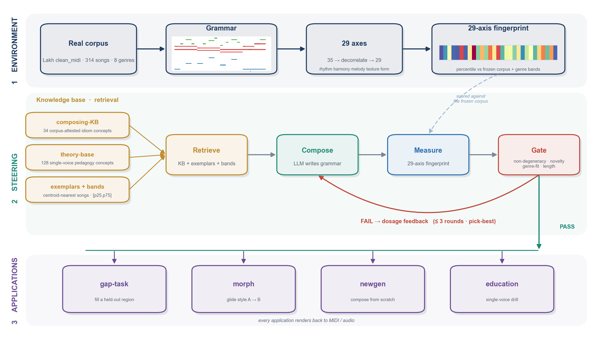

# Libretto (谱文)

A **descriptive** symbolic-music fingerprint environment. MIDI → a text "grammar" → a **29-axis
empirical-percentile fingerprint** against a frozen 314-song corpus distribution. Coordinates measure
*typicality / structure / proximity*, **NOT quality**.

<p align="center">
  <br>
  <em>Build the environment (corpus → grammar → 29 axes) · steer the agent (retrieve → compose → measure → gate, with a self-evolving loop) · four applications.</em>
</p>

The measurement layer is deterministic and reproducible. Generation is an LLM and is pluggable.

> **For agents (no prior context):** read **[`ONBOARDING.md`](ONBOARDING.md)** (repo map + the exact function to
> call for each task) and **[`AGENT.md`](AGENT.md)** (the operating prompt: grammar → axes → retrieve → compose →
> measure → loop). Provenance of the corpus is in [`DATA_PROVENANCE.md`](DATA_PROVENANCE.md).

## Install
```bash
pip install -e .            # core measurement (numpy, scipy, scikit-learn, pretty_midi, music21)
pip install -e .[generation]   # + anthropic, only for the default Generator
```
Frozen data ships inside the package (`libretto/data/`); override the location with `LIBRETTO_DATA`.

## Quickstart (deterministic — no LLM)
```python
import libretto
from libretto.core import Song, metrics_for, copy_risk, decode_to_midi, encode_from_midi

g = libretto.data_root() / "grammar" / "song_0001.txt"
m = metrics_for(Song(g), g)            # 29 retained axes (+6 dropped candidates)
print(libretto.DISTRIBUTION_VERSION)    # 29-axis / 314-song / 2026-06-13
print(copy_risk(g)["copy_risk"])       # note-level overlap vs corpus
decode_to_midi(g, "out.mid")           # grammar -> MIDI
# encode_from_midi("in.mid", "adaptive", keep_drums=False, max_bars=None, anonymize=True)  # MIDI -> grammar text
```
Run the tests:
```bash
python -m pytest libretto/tests        # or: PYTHONPATH=. python -m libretto.tests.test_core
```

## Layout
```
libretto/
  core/         the 8 deterministic tools (Song, metrics_for, wsv, copy_risk, fingerprint,
                band_check, encode/decode, gaptask_channel_check) — reproducible, frozen
  data/         frozen artifacts (distribution, fps, grammar corpus, answer key, KB) — see FROZEN.md
  generation/   Generator protocol + ClaudeGenerator/EchoGenerator + per-task prompt templates
  tasks/        gaptask / newgen / newgen_extend / morph — each a SKILL.md runbook + reference scripts
  tests/        round-trip, 29-axis shape, copy_risk self-match, determinism
```

## The four tasks
| task | what | success (structural) |
|---|---|---|
| **gaptask** | regenerate a held-out real region (has ground truth) | proximity to REAL + beat% (89–98% out-of-sample); gate C1/C2/C3-note + channel-check |
| **newgen** | compose a whole piece from scratch | length + non-degenerate + new (copy_risk<0.30) + genre-fit |
| **newgen_extend** | extend/insert into a real song (no leakage) | coheres + non-degenerate + new + boundary |
| **morph** | bridge song A's component into song B's | exact ends + gradual monotonic crossfade A→B |
| **genre_loop** | self-evolving loop: compose toward a genre by feedback-driven dosage refinement | split axes converge into the genre band (mid-band, not ceiling); spread retained |
See each `tasks/<task>/SKILL.md` for the runbook. The loop's per-round engine is `core.genre_band_check`
(general & genre-adaptive) / `core.band_profile` (global); canonical round-by-round data ships under
`tasks/genre_loop/refdata/`.

## Reproducibility contract
- **Deterministic & reproducible:** `libretto.core` and every task's `measure` / `render`. Same input →
  identical output. Pinned to the data version in `FROZEN.md`.
- **Not reproducible:** generation (an LLM). Plug your own model into the `Generator` protocol; the
  canonical demo outputs are the saved `compositions/**` + `rendered_midi/**` in the source repo.
- **Honest scope:** all criteria are STRUCTURAL (typicality / proximity / coherence / novelty), not quality.

See **FROZEN.md** for the tagged version, the two integrity resolutions (note-level copy gate +
the grammar↔MIDI fidelity audit), and the 29th-axis validation-scope caveat.
